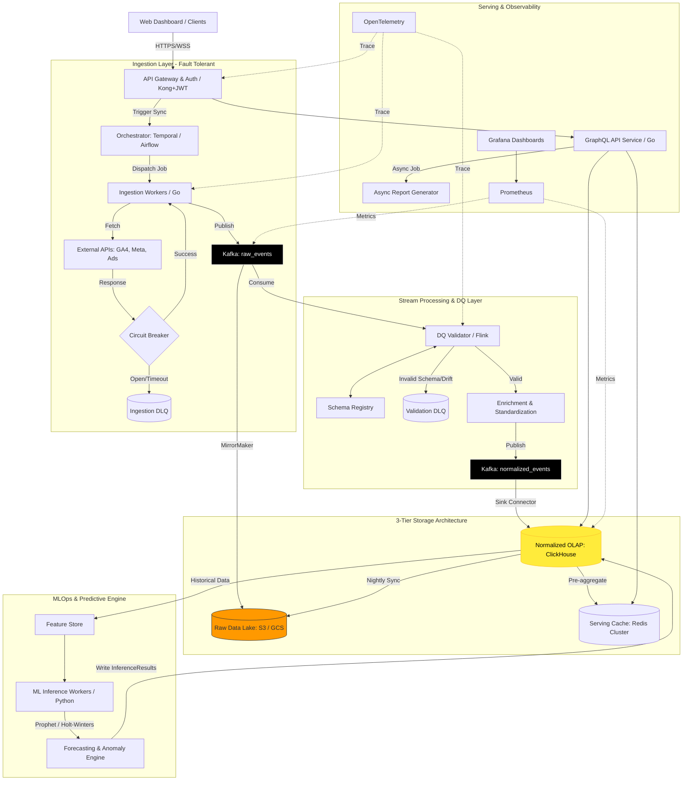
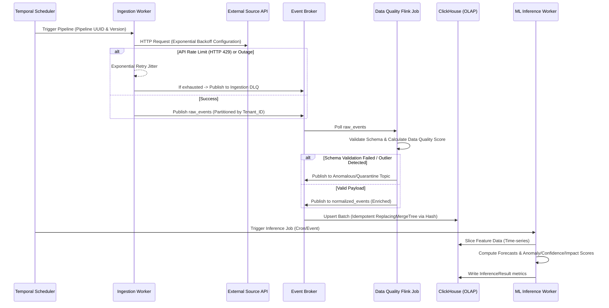
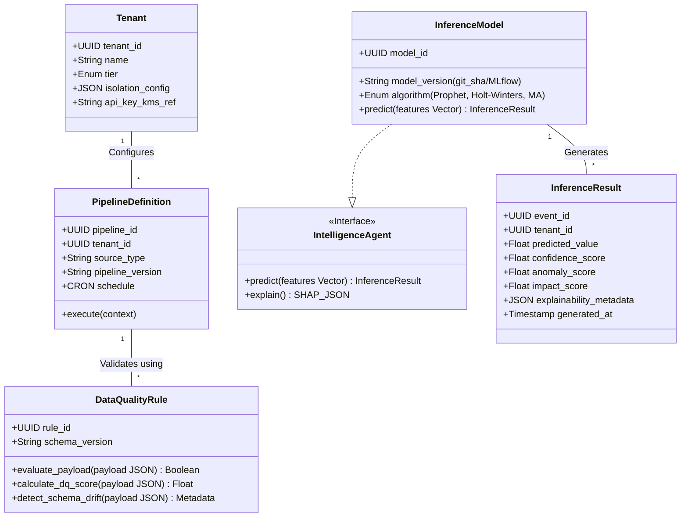

# DataBridge: Production-Ready Distributed Architecture & MLOps Blueprint

This document specifies the technical transformation of DataBridge from a monolithic Next.js application into a highly scalable, fault-tolerant, event-driven distributed system designed for enterprise-grade analytical workloads and multi-tenant SaaS operation.

---

## 1. System Architecture Diagram

The architecture is built upon an event-driven topology to guarantee decoupled processing, fault tolerance, and high availability. It utilizes a three-tier storage model (Raw, Normalized, Serving) and stream processing for real-time and batch workflows.

---

## 2. Activity Workflow (Data Lifecycle)

The lifecycle guarantees at-least-once or exactly-once semantics by employing dead-letter queues, idempotent writes, and persistent offsets.

---

## 3. Class Modeling (System Entities)

---

## 4. Subsystem Implementation Details

### 1. Reliability & Fault Tolerance
- **Retry Strategies**: Implement Exponential Backoff with Jitter for all external API requests to smoothly handle rate limits without overwhelming the network.
- **Circuit Breakers**: Wrapping external dependency calls (e.g., GA4, Meta APIs). If error thresholds are breached (e.g., 50% failure rate over 30s), the breaker opens, rejecting requests instantly and failing over to asynchronous queueing.
- **Dead Letter Queues (DLQ)**: Poison pills (malformed payloads) and persistently failing requests are routed to specific DLQs (Kafka topics) for alerting, manual resolution, and replay capability.
- **Idempotency**: Every ingested event is assigned a deterministic Hash ID (`MD5(tenant_id + source + metric + timestamp)`). Storage layers use `UPSERT` operations keyed by this hash, ensuring that repopulating pipelines or DLQ replays will never cause duplicate data.

### 2. Event-Driven Architecture (EDA)
- **Message Broker**: Introducing Apache Kafka as the immutable transaction log and central nervous system.
- **Decoupling**: The system uses a publish/subscribe model. Ingestion workers publish to `raw_events`, Flink processors subscribe, validate, enrich, and publish to `normalized_events`. Reporting APIs only read from OLAP. If API servers go offline, ingestion continues unaffected.
- **Event Schemas**: Defined using Protobuf or Avro in a centralized Schema Registry. Contracts must support backward compatibility rules to prevent breaking consumers during upgrades.

### 3. Observability
- **Distributed Tracing**: OpenTelemetry is injected into every service, appending `trace_id` headers. Allows visualization of a request's journey from API Gateway down to DB queries.
- **Structured Logging**: All applications log strictly in JSON format to standard output. Collected via Vector/FluentBit, forwarded to an ELK or Loki stack.
- **Metrics**: Standard integration exposing latency, error rates, and throughput (RED method) scraped by Prometheus, visualized on Grafana.

### 4. Data Quality Layer
- **Schema Validation Layer**: Intercepts payloads via the registry. Fails validation for illegal types.
- **Data Quality Scoring System**: Computes a completeness score based on missing fields and an integrity score for constraints.
- **Anomaly/Outlier Detection**: Calculates rolling standard deviations and flags records that sit beyond `3-sigma` (z-score >= 3).
- **Schema Drift Handling**: Logs warnings when extra unexpected columns appear in JSON from sources, caching them dynamically as nested JSONB properties pending manual review without crashing pipelines.

### 5. Data Storage Architecture
- **Raw Layer (Data Lake)**: S3 (or MinIO/GCS). Compressed Parquet files batched and flushed from Kafka via Sink Connectors. Cheap immutable storage for disaster recovery and ML training sets.
- **Normalized Warehouse (OLAP)**: ClickHouse. Configured with a `ReplacingMergeTree` table engine. Optimally structured columnar format to power sub-second analytical aggregations across billions of rows.
- **Serving Layer (Cache/API)**: Redis Cluster handling pre-aggregated queries (Dashboard daily stats) and ephemeral query caching to deflect repetitive load from ClickHouse.

### 6. Intelligence Agents Redesign (MLOps)
Replaced ambiguous "Agents" with strict deterministic algorithms:
- **Inputs**: Defined feature vectors from the Feature Store.
- **Outputs**: Structs containing `predicted_value`, `confidence_score` (between 0-1 based on data volume and variance), `anomaly_score` (magnitude of deviation), and `impact_score` (financial weight of the anomaly, evaluating CPC vs Budget).
- **Explainability Layer**: Generating SHAP (SHapley Additive exPlanations) values to output JSON maps interpreting predictions (e.g. `{"cause": "Meta Ads CPM increased 40%", "impact_weight": 0.82}`).

### 7. Versioning & Reproducibility
- **Pipeline & Mapping Versioning**: ETL logic shifts are versioned in Git. Transformations are assigned unique version tags evaluated at runtime.
- **ML Model Reproducibility**: Managed by MLflow. Training artifacts, hyperparameters, and git commits are logged on a registry.
- **Report Reproducibility**: Generating a snapshot ID for specific report queries.

### 8. Security & Multi-Tenant Isolation
- **RBAC & Gateway Security**: JWT tokens verified by API gateway. Claims contain Tenant ID and Role.
- **Row-Level Security (RLS)**: OLAP Database and PostgreSQL are constrained using connection contexts. A user intrinsically cannot query `WHERE tenant_id != self.tenant_id`.
- **Encryption**: Data is encrypted at transit via TLS 1.3. Credentials for API integrations are encrypted at rest using a KMS provider before storing in a DB Vault. Audit logs record every configuration mutation.

### 9. Performance & Scalability
- **Parallel Processing**: Kafka partitioning by Tenant or Source allows infinite horizontal scaling of ingestion and streaming worker nodes.
- **Async Report Generation**: Heavy aggregations for PDF/Excel exports are offloaded to background workers, pinging the UI heavily via WebSocket upon completion.
- **Pre-Aggregation Strategies**: ClickHouse Materialized Views continuously aggregate high-cardinality data by hour/day to optimize frequent dashboard visualization queries.

### 10. Cost Optimization
- **Data Lifecycle Policies**: Hot data (last 90 days) lives in ClickHouse. Cold data is moved to S3 (queryable via external tables but slightly slower) thereby drastically reducing compute costs.
- **Optimized Compute**: Flink processes streaming deduplication efficiently in memory. Batching API calls maximizes throughput per computational cycle.

### 11. Predictive Layer Enhancements
- **Time-Series Algorithms**: Leveraging Moving Averages and Exponential Smoothing for simple high-performance trending.
- **Advanced Forecasting**: Integration of Prophet (Facebook) and ARIMA to respect campaign periodicities, holiday seasonality, and sudden trend-shifts.
- **Feature Engineering**: Creating derived indicators (e.g. day-of-week, campaign cycles) ensuring ML models have contextual awareness of marketing behavior.

---

## 5. Trade-offs, Bottlenecks, & Weaknesses of Current System

### Weaknesses in the Current Monolithic State (Next.js / SQLite Base)
- **Concurrency Limitation**: SQLite handles writes sequentially, causing "database locked" errors under simultaneous analytics insertion.
- **Synchronous Bottlenecks**: Web API fetches from GA4 and writes dynamically. An API timeout cascades to user HTTP 504 timeouts.
- **Memory Caps**: Next.js API routes are not designed for massive data-frame aggregations and will crash under Node.js memory pressure.

### Architectural Trade-offs in New Design
- **Complexity vs Reliability**: Adopting Kafka and Flink introduces extreme distributed systems complexity, requiring dedicated infrastructure engineering (ZooKeeper/KRaft maintenance), contrasting sharply to the simplicity of SQLite.
- **ClickHouse Mutability**: ClickHouse thrives on immutable batch inserts. Frequent single-row updates (like updating a user's name) are highly inefficient, necessitating a hybrid DB approach (Postgres for CRUD state, ClickHouse for Analytics).
- **Latency Consistency**: An event-driven architecture relies on eventual consistency. A user initiating an ingestion sync may see a lag of a few seconds before data populates on dashboards due to the broker processing pipeline.

---

## 6. Recommended Production Tech Stack

| Layer | Recommended Technology |
| --- | --- |
| **Edge & API Gateway** | Kong API Gateway (or AWS API Gateway) |
| **Backend & Serving API** | Go (Fiber/Chi) or Node-Express (fast & concurrent) |
| **Event Broker** | Apache Kafka (Managed MSK / Confluent) or Redpanda |
| **Workflow Orchestration** | Temporal.io (Superior state handling) or Apache Airflow |
| **Stream Processing** | Apache Flink |
| **OLAP Database** | ClickHouse |
| **Transactional Database** | PostgreSQL (RDS / Aurora) |
| **Caching & Pub/Sub** | Redis Cluster |
| **Object Storage & Lake** | Amazon S3 |
| **MLOps & Inference** | Python (FastAPI + Prophet) managed by MLflow |
| **Observability** | Prometheus, Grafana, OpenTelemetry, ELK/Datadog |
| **Infrastructure / Deploy** | Kubernetes (EKS/GKE), Terraform, Docker |

---

## 7. Migration Path Forward

Migrating from the existing single-server MVP to a decentralized SaaS topology requires a structured, phased roll-out to avoid service interruptions.

1.  **Phase 1: Database Strangler Pattern**
    - Deploy PostgreSQL alongside SQLite. Migrate User and Config schema to Postgres. Deploy ClickHouse and duplicate incoming write operations synchronously from the Next.js API routes into both systems for verification.
2.  **Phase 2: Broker Introduction**
    - Stand up Kafka. Update Next.js ingest routes to produce messages to Kafka instead of direct DB inserts. Run a basic consumer script to insert into ClickHouse. This severs the synchronous read-write lock.
3.  **Phase 3: Worker Extraction**
    - Refactor the Next.js ingestion logic into isolated Go or Python background workers governed by Temporal. Remove massive job execution from the web server runtime.
4.  **Phase 4: Streaming & Streaming Analytics (Data Quality)**
    - Introduce Flink and the Schema Registry. Route raw Kafka events through Flink for normalization before flushing to the OLAP. Implement the DLQs.
5.  **Phase 5: Refactoring Serving Layer & Client Delivery**
    - Redirect the frontend Dashboard APIs to query Redis/ClickHouse directly via a dedicated backend service, abandoning the monolithic schema. Add RBAC & API Gateway definitions.
