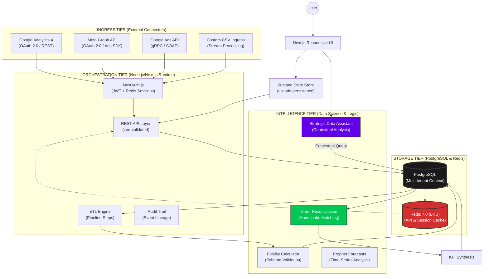

# DataBridge: Strategic Analytics & ETL Orchestration Blueprint

DataBridge is a high-fidelity, industrial-grade data engineering platform designed for marketing agencies managing complex multi-tenant ecosystems. It facilitates seamless extraction, transformation, and reconciliation of marketing telemetry into verifiable business intelligence.

---

## 🏗️ Detailed Architectural Topology



---

## 🛠️ Performance & Technical Specifications

### 1. High-Fidelity Technology Stack
- **Frontend Core**: Next.js 15 (App Router Architecture), TypeScript 5.4.
- **Styling Engine**: Tailwind CSS 4.0 with Custom Industrial Glassmorphism Presets.
- **Persistence Layer**: PostgreSQL (Target Environment) / SQLite (Initial Seed).
- **ORM / Projection**: Prisma ORM with procedural context-switching.
- **Distributed Cache**: Redis 7.0 for API response caching (30s-300s TTLs) and session state.
- **Async State**: TanStack Query v5 with stale-while-revalidate (SWR) patterns.

### 2. Multi-Tenant Context Isolation (MTCI)
The platform implements a **Strict Context Scoping** model to prevent data leakage across agency clients:
- **Procedural Scoping**: Every API route (e.g., `stats/platform`) parses a mandatory `clientId` or `orgId`.
- **Relationship Hierarchy**: `Agency` > `SMEClient` (orgId) > `User` / `DataSource` / `Pipeline`. 
- **RBAC Matrix**:
    - `SUPER_ADMIN`: Global observability and infrastructure management.
    - `AGENCY_ADMIN`: Full control over clients, sources, and reports within their agency.
    - `SME`: Limited access to specific client dashboards and performance metrics.

---

## 📊 Analytical Modeling & KPI Engine

### I. ROAS (Return on Ad Spend) Optimization
**Formula**: $\frac{\sum Metrics.value \text{ (type: revenue)}}{\sum Metrics.value \text{ (type: spend)}}$
*Aggregated daily and month-to-date (MTD) with automated currency normalization.*

### II. Handshake Match Rate (Reconciliation Accuracy)
Matches transactional orders to marketing touchpoints using the `OrderMatching` engine:
- **Phone Match**: Linking by hashed contact vectors.
- **Time Match**: Temporal proximity across data points.
- **Campaign Match**: Direct UTM attribution tagging.
- **Confidence Scoring**: 0.0 to 1.0 probability index per match.

### III. Data Fidelity Score
A dynamic index calculated as:
$$Fidelity = \frac{ValidatedRows}{TotalIngestedRows} \times SyncFrequencyWeight$$
This score reflects the integrity of the data stream and the reliability of the derived insights.

---

## ⚡ Caching & Invalidation Strategy

| Dataset Type | Cache TTL | Invalidation Trigger |
|---|---|---|
| **KPI Metrics** | 30 Seconds | Pipeline Completion |
| **Activity Log** | 30 Seconds | New System Event |
| **User Profiles** | 60 Seconds | Profile Update / Role Change |
| **Reports/Exports** | 300 Seconds | Manual Generation Request |
| **Branding/Asset** | 3600 Seconds | Agency Settings Modification |

---

## 🚀 Deployment & Operations

### Database Synchronization
```bash
# Push schema topology
npx prisma db push

# Generate industrial test dataset (~125,000 data points)
npx prisma db seed
```

### Local Development Environment
```bash
# Start Next.js development server
npm run dev

# Launch Prisma Studio for direct data observation
npx prisma studio
```

---

## 📜 Intellectual Property & Auditing
Proprietary Industrial Framework. Built for high-growth agencies requiring auditable, high-fidelity marketing intelligence. 
All event flows are logged to the `ActivityLog` table with IP-address and principal verification for absolute traceability.
